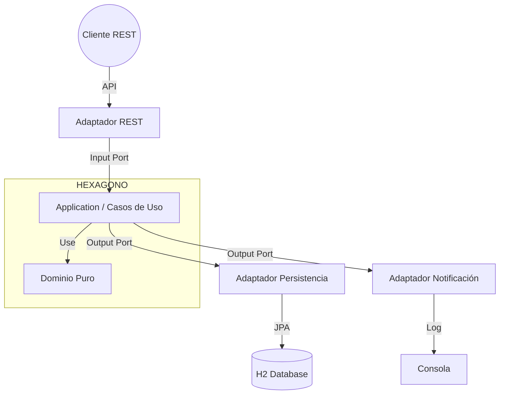

# 🏛️ Banco Digital - Arquitectura Hexagonal

  

Proyecto final para el curso de Arquitectura de Software (Módulo 2). Implementación de un sistema de gestión bancaria aplicando estrictamente **Arquitectura Hexagonal (Ports & Adapters)** y **Domain-Driven Design (DDD)**.

---

## 🏗️ Arquitectura y Diseño

El sistema está diseñado para desacoplar completamente la lógica de negocio (Dominio) de los detalles técnicos (Frameworks, BD, UI).

### Diagrama Hexagonal Simplificado



# 📂 Estructura del Proyecto

```text
banco-hexagonal/
├── docs/                            # 📄 DOCUMENTACIÓN DE ARQUITECTURA
│   ├── ADR-001-arquitectura-hexagonal.md
│   ├── ADR-002-sistema-persistencia.md
│   └── ADR-003-estrategia-mapeo-objetos.md
│
├── src/main/java/pe/edu/tecsup/bancodigital/
│   │
│   ├── domain/                      # 🟢 CAPA DE DOMINIO (Núcleo Puro - Java)
│   │   ├── exception/               # Excepciones de negocio (ej. InsufficientBalance)
│   │   └── model/                   # Entidades del Dominio
│   │       └── vo/                  # Value Objects (ej. Money)
│   │
│   ├── application/                 # 🟡 CAPA DE APLICACIÓN (Orquestación)
│   │   ├── ports/                   # Interfaces / Contratos
│   │   │   ├── input/               # Casos de uso (ej. TransferUseCase)
│   │   │   └── output/              # Puertos de salida (ej. AccountRepositoryPort)
│   │   └── usecases/                # Implementación de servicios (ej. BankAccountService)
│   │
│   └── infrastructure/              # 🔴 CAPA DE INFRAESTRUCTURA (Frameworks & Drivers)
│       ├── adapters/
│       │   ├── input/
│       │   │   └── rest/            # Adaptador REST (Controllers, DTOs, Advice)
│       │   │   │   └── advice/
│       │   │   │   └── dto/
│       │   └── output/
│       │       ├── notification/    # Adaptador de Notificación (Consola)
│       │       └── persistence/     # Adaptador de Base de Datos
│       │           ├── entity/      # Entidades JPA (Tablas)
│       │           ├── mapper/      # MapStruct (Domain <-> Entity)
│       │           └── repository/  # Interfaces Spring Data JPA
│       └── config/                  # Configuraciones (Singleton, Beans, Swagger)
│
├── src/main/resources/
│   ├── application.yml              # Configuración de Spring Boot y H2
│   ├── data.sql                     # Datos de prueba precargados
│   ├── log4j2-spring.xml            # Configuración de Logging profesional
│   └── schema.sql                   # Estructura de tablas (DDL manual)
│
├── pom.xml                          # Dependencias Maven
└── README.md                        # Documentación principal
```

## 🧩 Patrones de Diseño Aplicados

En este proyecto se han implementado diversos patrones de diseño para garantizar un código desacoplado, mantenible y robusto, cumpliendo con los requisitos académicos y estándares de la industria.

### 1. Patrón Adapter (Ports & Adapters) - *Obligatorio*
Este es el corazón de la Arquitectura Hexagonal. Permite que el núcleo de la aplicación interactúe con tecnologías externas sin depender de ellas.
* **Input Adapter:** `AccountController` (REST) adapta las peticiones HTTP a comandos que entienden los casos de uso (`Input Ports`).
* **Output Adapter:** `JpaPersistenceAdapter` implementa las interfaces del dominio (`Output Ports`) para guardar datos usando Spring Data JPA.
* **Output Adapter:** `ConsoleNotificationAdapter` adapta el envío de notificaciones a la salida estándar del sistema.

### 2. Patrón Singleton - *Obligatorio*
Garantiza que una clase tenga una única instancia y proporciona un punto de acceso global a ella.
* **Implementación:** Clase `BankConfigSingleton` en `infrastructure/config`.
* **Uso:** Gestiona la configuración global inmutable del banco (ej. moneda base `PEN`, comisión por defecto `5.00`), simulando una carga de configuración centralizada.

### 3. Patrón Value Object (Domain-Driven Design)
Objeto inmutable definido por sus atributos y no por una identidad.
* **Implementación:** Record `Money` en `domain/model/vo`.
* **Uso:** Encapsula la lógica financiera (redondeo a 2 decimales, validación de no negativos, operaciones aritméticas), evitando el "anti-patrón de obsesión por primitivos" (usar `BigDecimal` sueltos).

### 4. Patrón Data Transfer Object (DTO)
Objeto que transporta datos entre procesos para reducir el número de llamadas a métodos.
* **Implementación:** Records `CreateAccountRequest`, `TransferRequest`, `AccountResponse`.
* **Uso:** Desacopla la capa de presentación (API REST) del modelo de dominio. Asegura que no se expongan entidades internas directamente al cliente.

### 5. Patrón Builder (vía Lombok)
Separa la construcción de un objeto complejo de su representación.
* **Implementación:** Anotación `@Builder` en entidades como `Transaction` y `Client`.
* **Uso:** Facilita la creación de objetos complejos en los Mappers y Servicios, mejorando la legibilidad del código frente a constructores largos.

## 📄 Documentación de Decisiones (ADRs)

Las decisiones arquitectónicas clave se encuentran documentadas en formato Markdown dentro de la carpeta `/docs`:

* [ADR-001: Adopción de Arquitectura Hexagonal](./docs/ADR-001-arquitectura-hexagonal.md)
* [ADR-002: Estrategia de Persistencia (H2)](./docs/ADR-002-sistema-persistencia.md)
* [ADR-003: Estrategia de Mapeo (MapStruct)](./docs/ADR-003-estrategia-mapeo-objetos.md)

## 🚀 Guía de Ejecución

### Prerrequisitos
* **Java JDK 21** instalado y configurado en el `PATH`.
* **Apache Maven** (3.8 o superior) instalado.

### Pasos para iniciar
1.  **Obtener el código:** Clonar el repositorio o descomprimir el archivo `.zip`.
2.  **Abrir Terminal:** Navegar hasta la carpeta raíz del proyecto (donde está el archivo `pom.xml`).
3.  **Ejecutar:** Escribir el siguiente comando:
    ```bash
    mvn spring-boot:run
    ```
4.  **Verificar:** Esperar unos segundos hasta ver el mensaje de éxito en la consola:
    > `🚀 BANCO DIGITAL INICIADO - PATRON HEXAGONAL 🚀`

5.  **Listo:** El sistema estará disponible y escuchando en el puerto **8080**.

---

## 👨‍💻 Autor

**Nombre:** Gabriel Antonio Macavilca Almanza \
**Curso:** Arquitectura de Software\
**Institución:** Tecsup\
**Año:** 2025
---